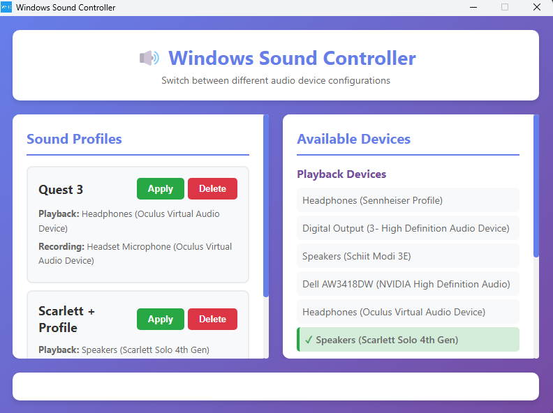

# Windows Sound Controller

A simple desktop application that allows you to create and switch between different audio device profiles on Windows. Perfect for users who frequently switch between different audio setups (headphones, speakers, microphones, etc.).



## Features

- 🎵 Create multiple sound profiles with different playback and recording devices
- 🔄 Quickly switch between profiles with one click
- 📊 View all available audio devices
- 💾 Profiles are automatically saved and persist between sessions
- 🎨 Clean, modern user interface

## Download & Installation

### For End Users (Recommended)

**Download the latest release:**

1. Go to the [Releases page](https://github.com/YOUR_USERNAME/windows-sound-profile-manager/releases)
2. Download one of the following:
   - **`Windows Sound Controller-Setup-X.X.X.exe`** - Full installer with desktop shortcut
   - **`Windows Sound Controller-Portable-X.X.X.exe`** - Portable version (no installation required)

3. **Important:** Install the required PowerShell module:
   - Open PowerShell as Administrator
   - Run: `Install-Module -Name AudioDeviceCmdlets -Force`

4. Run the application!

### For Developers

**Prerequisites:**
- Node.js 18+ installed
- PowerShell AudioDeviceCmdlets module (see above)

**Setup:**
```bash
# Clone the repository
git clone https://github.com/YOUR_USERNAME/windows-sound-profile-manager.git
cd windows-sound-profile-manager

# Install dependencies
npm install

# Run in development mode
npm start

# Build installers
npm run dist
```

## Usage

### Creating a Profile

1. Click the **"+ Add New Profile"** button
2. Enter a name for your profile (e.g., "Studio Setup", "Gaming", "Oculus VR")
3. Select your desired playback device from the dropdown
4. Select your desired recording device from the dropdown
5. Click **"Save Profile"**

### Applying a Profile

Simply click the **"Apply"** button on any profile card. The application will:
- Set your default playback device
- Set your default recording device
- Show a success message when complete
- Update the device list to show the new defaults (marked with a checkmark)

### Example Profiles

**Profile 1: Studio Setup**
- Playback: Scarlett Solo 4th Gen
- Recording: Sennheiser Profile

**Profile 2: VR Gaming**
- Playback: Oculus Virtual Audio Device
- Recording: Oculus Virtual Audio Device

### Managing Profiles

- **Delete**: Click the "Delete" button on any profile to remove it
- **Refresh Devices**: Click the "🔄 Refresh Devices" button to reload the list of available audio devices

## How It Works

This application uses:
- **Electron** for the desktop GUI framework
- **PowerShell AudioDeviceCmdlets** to control Windows audio devices
- **Node.js** to bridge the GUI and PowerShell scripts

The app directly controls the Windows Sound control panel settings, setting the default playback and recording devices system-wide.

## Building for Distribution

### Local Build

To create installers locally:

```bash
# Install dependencies (if not already done)
npm install

# Build both installer and portable versions
npm run dist
```

This will create in the `dist/` folder:
- `Windows Sound Controller-Setup-X.X.X.exe` - NSIS installer
- `Windows Sound Controller-Portable-X.X.X.exe` - Portable executable

### Automated GitHub Releases

This project includes GitHub Actions automation:

1. **Create a new release:**
   ```bash
   git tag v1.0.0
   git push origin v1.0.0
   ```

2. GitHub Actions will automatically:
   - Build the Windows installer and portable exe
   - Create a GitHub release
   - Attach the executables to the release

3. Users can then download from the Releases page!

## Troubleshooting

### "AudioDeviceCmdlets module not installed" error

Make sure you've installed the PowerShell module as described in the Prerequisites section.

### Devices not showing up

1. Click the "Refresh Devices" button
2. Make sure your audio devices are properly connected
3. Check Windows Sound settings to verify the devices are visible there

### Permission issues

Make sure you're running PowerShell as Administrator when installing the AudioDeviceCmdlets module.

## Project Structure

```
Sound Controller/
├── src/
│   ├── main.js          # Electron main process
│   ├── preload.js       # Electron preload script for IPC
│   ├── renderer.js      # Frontend JavaScript
│   ├── index.html       # Main UI
│   └── styles.css       # UI styles
├── scripts/
│   └── AudioDeviceControl.ps1  # PowerShell script for device control
├── package.json
└── README.md
```

## License

MIT

## Contributing

Feel free to submit issues and pull requests!
